# SQL Murder Mystery

SQL Murder Mystery is an interactive and educational mystery game that helps people learn SQL concepts in a fun and engaging way. It was created by *Knight Lab* team at Northwestern University and has gained popularity as a hands-on learning tool for SQL enthusiasts.

Source link: [click here](https://mystery.knightlab.com/)

## 1. Scenario
A crime has taken place, and the detective needs your help. The detective gave you the crime scene report, but you somehow lost it. You vaguely remember that the crime was a murder that occurred sometime on 15th January, 2018 and that it took place in SQL City. Start by retrieving the corresponding crime scene report from the police department’s database.

## 2. Database Design
Here is the schema Diagram or ERD from the original source

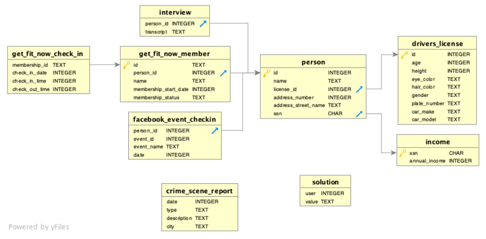

Here are the tables and potential information within them:

|No|Table Name|Data Related|
|---|:---:|:---|
|1|**crime_scene_report**|Initial leads information to the specific crime.|
|2|**interview**|Interview result documentation with related person of crimes|
|3|**person**|General profile data|
|4|**drivers_license**|Profile data related person and their car|
|5|**income**|Profile data related to annual income|
|6|**get_fit_now_member**|Membership of *Get Fit Now* Gym|
|7|**get_fit_now_check_in**|Activity log check-in and check-out of *Get Fit Now* Gym members|
|8|**facebook_event_checkin**|Activity log about any event attended by specific person|

## 3. Step-by-step
### 3.1. Crime Scene Report

Our only leads data are below:
- The crime that happened in SQL city is murder
- It is occurred sometime on 15th January, 2018

Let's dive into the crime scene report!

```sql
SELECT *
FROM crime_scene_report
WHERE city = "SQL City"
	AND type = "murder"
	AND date = "20180115"   # 15 Jan 2018
```

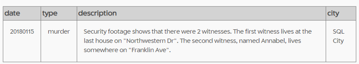

The key point is there were 2 witnesses:
1.	The first witness lives at the last house on "Northwestern Dr"
2.	The second witness, named Annabel, lives somewhere on "Franklin Ave".


### 3.2. Witness’s Profile
#### Witness #1
```sql
select *
from person
where address_street_name = "Northwestern Dr"
and address_number = (select max(address_number)
from person
where address_street_name = "Northwestern Dr")
```
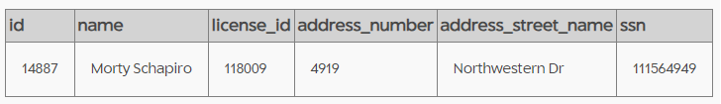

#### Witness #2
```sql
select *
from person
where address_street_name = "Franklin Ave"
	and lower(name) like "%annabel%"
```
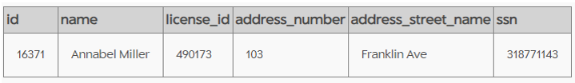


### 3.3. Interview Result

Time to check the interview result with the witnesses.

```sql
select *
from interview
where person_id in (14887, 16371)
```
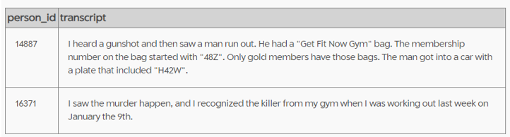


Here are some important information:
- From witness #1 (Morty Schapiro):
    -	The killer has “Get Fit Now Gym” bag with membership number “48z”
    -	It is suspected a gold member only bag
    -	The killer got into car with plate number “H42W”

- From witness #2 (Annabel Miller):
    -	The killer from the same gym of the witness
    -	The murder happened when the witness was working last week on 9th January 2018

### 3.4. Identify The Killer Profile based on Interview Leads

Let’s shrink down the possibility.

First, we can get some leads based on plate number data.


```sql
select person.id as person_id,
	name, license_id, address_number, address_street_name,
	ssn, age, height, eye_color, hair_color,
	gender, plate_number, car_make, car_model
from person 
join drivers_license on person.license_id = drivers_license.id
where plate_number like "%H42W%"
```
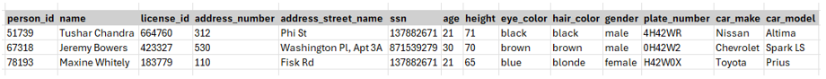

Hmm.. There are three persons based on the plate number criteria.

The killer must be one of them.

### 3.5. Check for Gym Membership Data

Now we check the *Get Fit Now* Gym membership among those three suspects.

```sql
select *
from get_fit_now_member
where person_id in (51739, 67318, 78193)
and lower(id) like “%48z%”
```
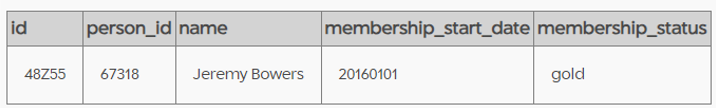


Of the three suspect, only Jeremy Bowers has the gold gym membership and registered since 1st January 2016.

Ok, now we can deep dive check specifically on him.

Let's check when he last time went to gym.


Check-in and check-out activities of gym members
```sql
select *
from get_fit_now_check_in
where membership_id = "48Z55"
```
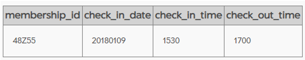

The last time he went to gym at 9th January 2018 from 15:30 to 17:00.

### 3.6. Track the activities using Social Media
```sql
select *
from facebook_event_checkin
where person_id = 67318
```
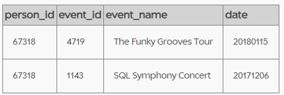


Hmm…. All the information so far leads to Jeremy Bowers as the killer.

All evidence match and point to him.

Then.. let’s submit that conclusion and see the result.

```sql
INSERT INTO solution VALUES (1, 'Jeremy Bowers');
SELECT value FROM solution;
```
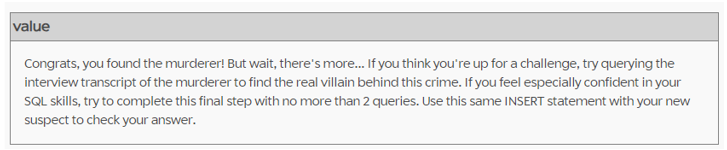

It seems we still have another mission that is find the mastermind behind the crime.


### 3.7. Interview Record with the Suspect
```sql
select *
from interview
where person_id = 67318
```
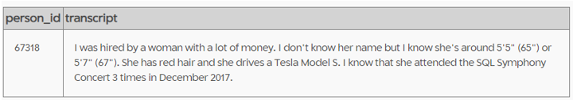


Here are breakdown detail information of the interview:
- The killer was hired by a woman
- Her height around 65" - 67"
- She has red hair
- She drives a Tesla Model S
- Based on description, she attended the **SQL Symphony Concert** 3 times in December 2017

### 3.8. The Mastermind of the Crime
```sql
select person.name,
	person.ssn,
	income.annual_income,
	drivers_license.*,
	event_name,
	_fb.date as event_date
from person 
join drivers_license on person.license_id = drivers_license.id
join facebook_event_checkin as _fb on person.id = _fb.person_id 
left join income on person.ssn  = income.ssn
where car_make = "Tesla" 
	and car_model = "Model S"
	and hair_color = "red"
	and gender = "female"
ORDER BY _fb.date
```
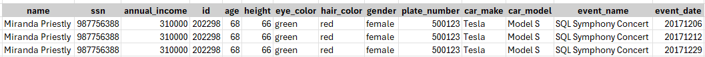

Finally, we have all evidence to corner the perpretrators.

Let's reveal the truth and arrest them! 🕵️‍♂️

```sql
INSERT INTO solution VALUES (1, 'Miranda Priestly');
SELECT value FROM solution;
```
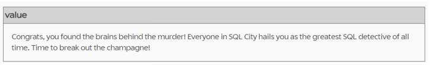

Hooray!!! 🎉🎉🎉

With that, the case has been completely solved ✅✅✅ 
